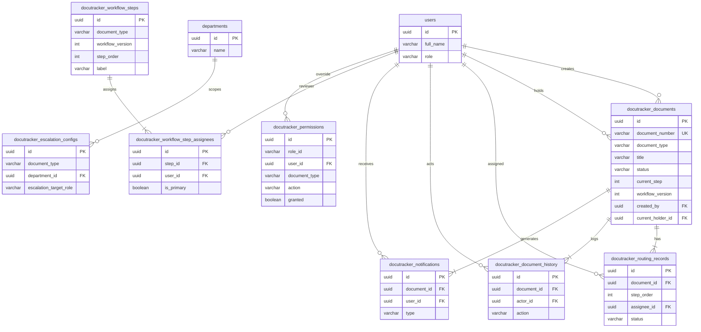
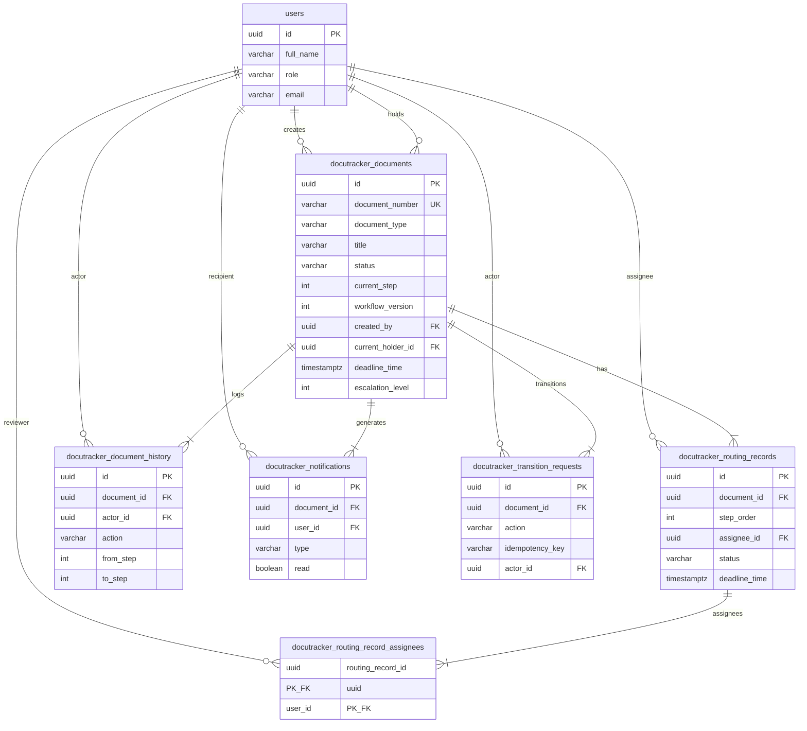
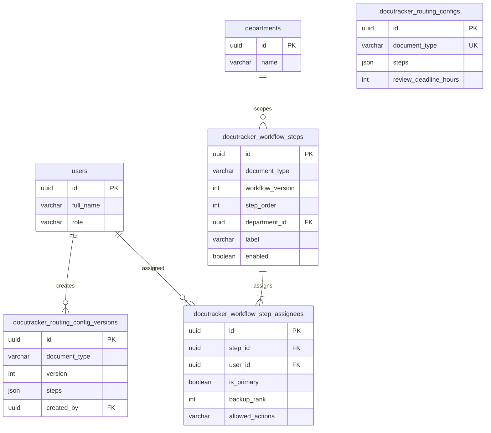
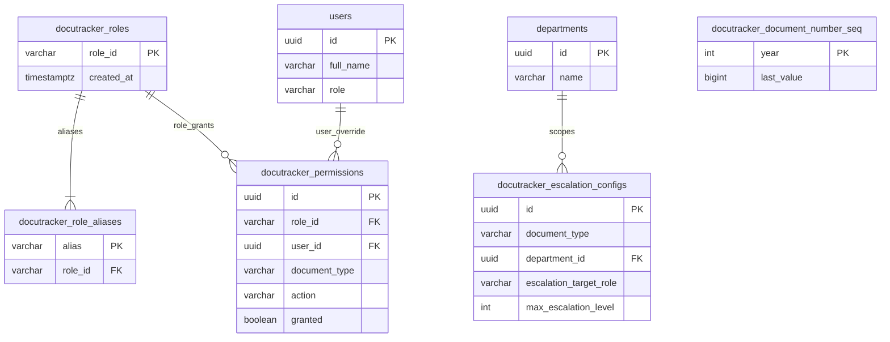

# DocuTracker ERD — Mermaid (4 parts)

Paste each block into [Mermaid Live](https://mermaid.live) or draw.io (**Arrange → Insert → Advanced → Mermaid**).

---

## Part 0 — Overview (Figure 5)

---

## Part 1 — Documents and Runtime (Appendix A.1)

---

## Part 2 — Workflow Configuration (Appendix A.2)

> **Note:** `routing_config_versions` links to `workflow_steps` logically by `(document_type, workflow_version)` — not a DB foreign key.

---

## Part 3 — Security and Escalation (Appendix A.3)

> `docutracker_document_number_seq` has no foreign-key relationships.
