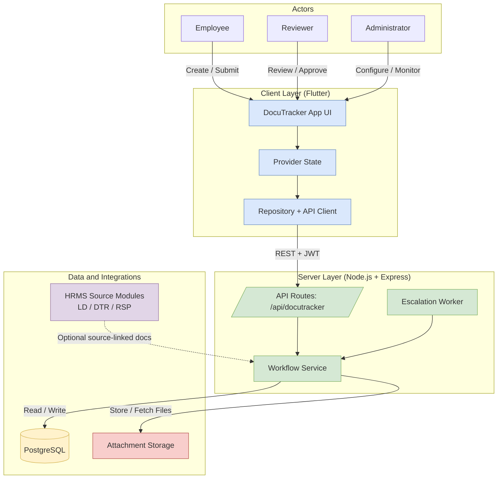

# DocuTracker System Architecture — Mermaid

Use this for markdown docs, Mermaid Live, or draw.io Mermaid import.

## Caption

**Figure 8.** System architecture of the DocuTracker module showing actor interaction with the Flutter client, Node.js backend services, PostgreSQL database, attachment storage, and optional HRMS source-module integration.

