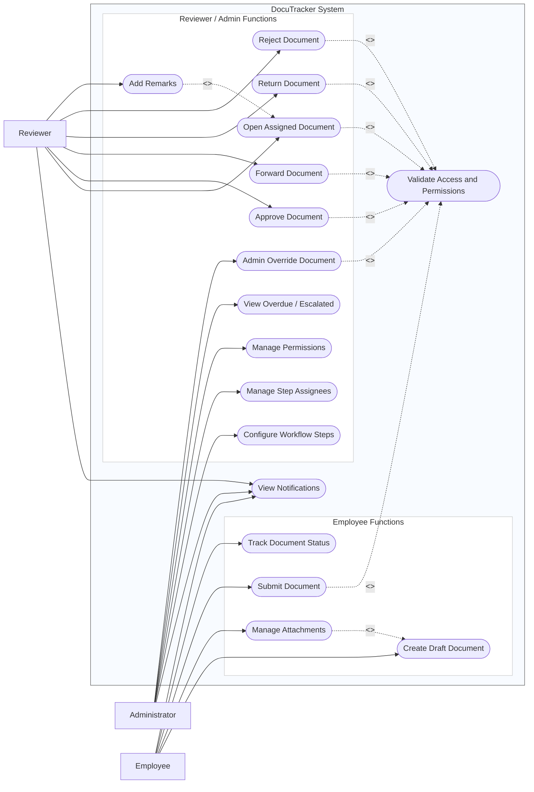

# DocuTracker Use Case Diagram — Mermaid

## Caption

**Figure 9.** DocuTracker use case diagram showing Employee (right), Reviewer (left), and Administrator (left) interactions with document workflow and administration functions.

