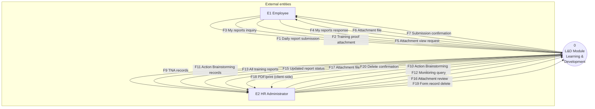
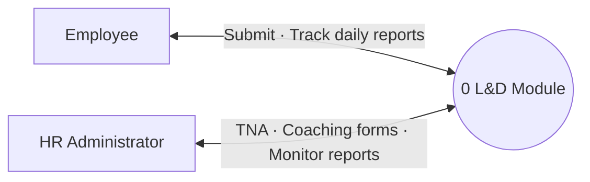

# L&D Module — Data Flow Diagram (DFD) Level 0

**Context diagram** for the Learning & Development (L&D) module in **HRMS Plaridel**. At Level 0 the entire L&D subsystem is shown as **one process** with **external entities** and **labeled data flows** only (no internal data stores or sub-processes).

Based on: `_LdContent` (`lib/admin/screens/admin_dashboard.dart`), `TrainingDailyReportEmployeeScreen`, `TrainingDailyReportRepo`, `/api/training-daily-reports`, `/api/rsp-ld-saved-entries/*` (TNA & Action Brainstorming tables), and `uploads/training-reports/`.

---

## Central process

| ID | Name | Description |
|----|------|-------------|
| **0** | **L&D Module** | Supports learning & development: HR planning forms (Training Need Analysis, Action Brainstorming worksheets) and employee daily training report submission with HR monitoring. |

---

## External entities

| Entity | Description |
|--------|-------------|
| **E1 — Employee** | Authenticated HRMS user (`role: employee`) on training; submits and views own daily reports. |
| **E2 — HR Administrator** | Authenticated admin (`role: admin`) using the L&D hub in Admin Dashboard. |

> **Boundary note:** Login (`POST /auth/login`) is handled by the **HRMS core**, not drawn as a separate entity here. Employee and Administrator arrive at L&D already authenticated (JWT).

> **Out of scope at Level 0:** TNA and Action Brainstorming are **admin-only**; employees do not interact with those forms in the current L&D UI.

---

## Data flow catalogue

### Between Employee (E1) and L&D (0)

| Flow | Direction | Data content |
|------|-----------|--------------|
| F1 | E1 → 0 | **Daily report submission** — title, description, employee identity (from JWT) |
| F2 | E1 → 0 | **Training proof attachment** — JPG, PNG, or PDF file bytes |
| F3 | E1 → 0 | **My reports inquiry** — request list of own submitted reports |
| F4 | 0 → E1 | **My reports response** — report list with status, dates, attachment metadata |
| F5 | E1 → 0 | **Attachment view request** — attachment id for a owned report |
| F6 | 0 → E1 | **Attachment file** — streamed image/PDF for preview or download |
| F7 | 0 → E1 | **Submission confirmation** — created report id, initial status (`submitted`) |

### Between HR Administrator (E2) and L&D (0)

| Flow | Direction | Data content |
|------|-----------|--------------|
| F8 | E2 → 0 | **TNA form data** — CY year, department, consolidated table rows |
| F9 | 0 → E2 | **TNA records** — saved Training Need Analysis entries |
| F10 | E2 → 0 | **Action Brainstorming data** — department, date, coaching table rows, certification |
| F11 | 0 → E2 | **Action Brainstorming records** — saved worksheet entries |
| F12 | E2 → 0 | **Training reports monitoring query** — search, date range, status filter |
| F13 | 0 → E2 | **All training reports** — employee name, title, status, attachment refs |
| F14 | E2 → 0 | **Report review action** — mark seen, delete report |
| F15 | 0 → E2 | **Updated report status** — after review (e.g. `seen`) |
| F16 | E2 → 0 | **Attachment review request** — attachment id for employee report |
| F17 | 0 → E2 | **Attachment file** — file stream for HR review |
| F18 | 0 → E2 | **Printed/PDF worksheets** — generated **client-side** (`FormPdf`); no server data flow |

### Admin-only form maintenance (E2 ↔ 0)

| Flow | Direction | Data content |
|------|-----------|--------------|
| F19 | E2 → 0 | **Form record delete** — TNA or Action Brainstorming entry id |
| F20 | 0 → E2 | **Delete confirmation** — record removed from store |

---

## Level 0 diagram (Mermaid)

---

## Simplified context view (major flows only)

---

## Process boundary (what is inside 0)

| Inside L&D Module (0) | Outside (external) |
|------------------------|-------------------|
| `_LdContent` admin hub (3 feature cards) | Employee / admin workstations |
| `TrainingDailyReportEmployeeScreen` | HRMS authentication (JWT issuance) |
| APIs: `/api/training-daily-reports`, `/api/upload/training-report`, `/api/files/training-report/:id` | PostgreSQL (physical DB; stores in **DFD Level 1**) |
| APIs: `/api/rsp-ld-saved-entries/training_need_analysis_entries`, `…/action_brainstorming_coaching_entries` | |
| Rules: report status transitions, employee-scoped list (`mine`) | |
| Storage: `uploads/training-reports/` | |

---

## L&D features mapped to flows

| Feature | Primary entity | Flows |
|---------|----------------|-------|
| Training Daily Reports (employee) | E1 Employee | F1–F7 |
| Training Daily Reports (monitoring) | E2 HR Administrator | F12–F17 |
| Training Need Analysis | E2 HR Administrator | F8, F9, F19, F20 |
| Action Brainstorming & Coaching | E2 HR Administrator | F10, F11, F19, F20 |
| PDF / print worksheets | E2 HR Administrator | F18 (client only) |

---

## Related diagrams

| Document | Purpose |
|----------|---------|
| [LD_ADMINISTRATOR_SEQUENCE_DIAGRAM.md](LD_ADMINISTRATOR_SEQUENCE_DIAGRAM.md) | Admin interaction order |
| [LD_USER_SEQUENCE_DIAGRAM.md](LD_USER_SEQUENCE_DIAGRAM.md) | Employee interaction order |
| [RSP_DFD_LEVEL_0.md](RSP_DFD_LEVEL_0.md) | RSP context diagram (reference style) |

---

## Visual diagram

Rendered Level 0 PNG:

`docs/ld-dfd-level-0.png`

---

## Notation reference

| Symbol | Meaning |
|--------|---------|
| Circle `0` | Process (entire L&D module at this level) |
| Rectangle | External entity |
| Arrow + label | Named data flow |
| Dashed arrow | Client-side only (no API) |

**DFD Level 1** (next step) would decompose `0` into sub-processes, for example:

| ID | Sub-process |
|----|-------------|
| 1.0 | Manage training planning forms (TNA, Action Brainstorming) |
| 2.0 | Process daily training reports (submit & store) |
| 3.0 | Monitor & review reports (HR) |

…and data stores such as **D1 Training Reports**, **D2 TNA Entries**, **D3 Coaching Worksheets**, **D4 Attachments**.
