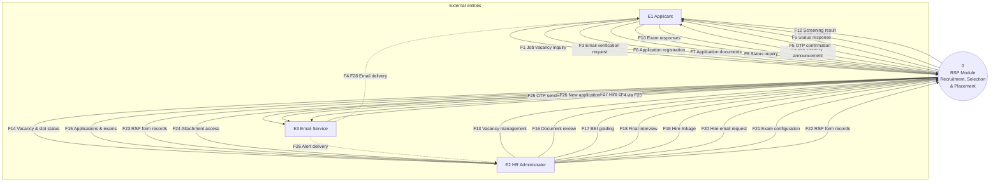
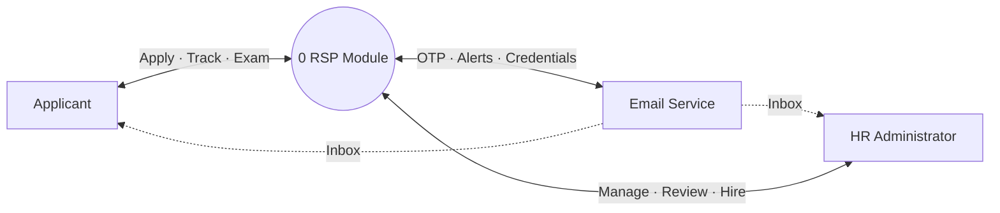

# RSP Module — Data Flow Diagram (DFD) Level 0

**Context diagram** for the Recruitment, Selection, and Placement (RSP) module in **HRMS Plaridel**. At Level 0 the entire RSP subsystem is represented as **one process** with **external entities** and **labeled data flows** only (no internal data stores or sub-processes).

Based on: `RspAdminContent`, `ApplicationFlowPage`, `TrackApplicationPage`, `/api/rsp/*`, and PostgreSQL tables `recruitment_applications`, `recruitment_exam_results`, `recruitment_exam_questions`, `job_vacancy_announcement`, `uploads/rsp-attachments/`.

---

## Central process

| ID | Name | Description |
|----|------|-------------|
| **0** | **RSP Module** | Manages public recruitment: job announcements, applications, document screening, exams, final interview tracking, and hire linkage within HRMS. |

---

## External entities

| Entity | Description |
|--------|-------------|
| **E1 — Applicant** | Public user applying or tracking via landing page / application flow (no HRMS login). |
| **E2 — HR Administrator** | Authenticated admin (`role: admin`) using RSP hub in Admin Dashboard. |
| **E3 — Email Service** | External EmailJS and/or SMTP used for OTP, HR alerts, and hire credentials. |

> **Boundary note:** Employee account creation (`POST /api/employees`) is invoked by HR through HRMS but is treated here as an **admin-initiated** flow into the RSP process (hire linkage), not a separate entity.

---

## Data flow catalogue

### Between Applicant (E1) and RSP (0)

| Flow | Direction | Data content |
|------|-----------|--------------|
| F1 | E1 → 0 | **Job vacancy inquiry** — request open positions |
| F2 | 0 → E1 | **Job vacancy announcement** — headlines, slots, position list |
| F3 | E1 → 0 | **Email verification request** — email address (+ optional name) |
| F4 | 0 → E3 → E1 | **OTP message** — 6-digit code (via Email Service) |
| F5 | E1 → 0 | **OTP confirmation** — email + code → verification token |
| F6 | E1 → 0 | **Application registration** — name, contact, sex, position applied |
| F7 | E1 → 0 | **Application documents** — PDFs (application letter, resume, TOR, eligibility) |
| F8 | E1 → 0 | **Application status inquiry** — email for track / continue |
| F9 | 0 → E1 | **Application status response** — status, timeline, interview dates, hire flags |
| F10 | E1 → 0 | **Exam responses** — BEI narratives + MCQ selections (combined submit) |
| F11 | 0 → E1 | **Exam content** — question banks + per-exam time limits |
| F12 | 0 → E1 | **Screening result** — overall score, pass/fail, BEI grading pending flag |

### Between HR Administrator (E2) and RSP (0)

| Flow | Direction | Data content |
|------|-----------|--------------|
| F13 | E2 → 0 | **Vacancy management data** — announcement, vacancies[], slot caps |
| F14 | 0 → E2 | **Vacancy & slot status** — current announcement + application counts |
| F15 | 0 → E2 | **Applications & exam monitoring** — applicant list, scores, attachments index |
| F16 | E2 → 0 | **Document review decision** — approve / decline / delete applicant |
| F17 | E2 → 0 | **BEI grading data** — per-answer scores, recalculated pass/fail |
| F18 | E2 → 0 | **Final interview data** — schedule datetime, pass/fail outcome |
| F19 | E2 → 0 | **Hire linkage** — employee `userId` matched to applicant email |
| F20 | E2 → 0 | **Hire email request** — username/password for applicant notification |
| F21 | E2 → 0 | **Exam configuration** — BEI / General / Math / General Info questions & time limits |
| F22 | E2 → 0 | **RSP form records** — BI, performance eval, IDP, selection lineup, etc. (saved entries CRUD) |
| F23 | 0 → E2 | **RSP form records** — list/read saved administrative forms |
| F24 | 0 → E2 | **Attachment access** — signed URL / view token for applicant PDFs |

### Between RSP (0) and Email Service (E3)

| Flow | Direction | Data content |
|------|-----------|--------------|
| F25 | 0 → E3 | **OTP send request** — recipient email, code, applicant name |
| F26 | 0 → E3 | **New application alert** — notify HR of new submission |
| F27 | 0 → E3 | **Hire credentials message** — applicant email, login username/password |
| F28 | E3 → E1 / E2 | **Delivered email** — (outside system; inbox delivery) |

---

## Level 0 diagram (Mermaid)

---

## Simplified context view (major flows only)

---

## Process boundary (what is inside 0)

| Inside RSP Module (0) | Outside (external) |
|------------------------|-------------------|
| Flutter: landing vacancies, application flow, admin RSP hub | Applicant browser / device |
| Express: `/api/rsp/*`, attachment storage routes | PostgreSQL (physical DB is infrastructure; stores appear in **DFD Level 1**) |
| Business rules: slot caps, BEI grading gate, status transitions | EmailJS / SMTP provider |
| File storage: `uploads/rsp-attachments/` | HR employee master (`users`) — linked at hire |

---

## Related diagrams

| Document | Purpose |
|----------|---------|
| [RSP_ADMINISTRATOR_SEQUENCE_DIAGRAM.md](RSP_ADMINISTRATOR_SEQUENCE_DIAGRAM.md) | Admin interaction order |
| [RSP_USER_SEQUENCE_DIAGRAM.md](RSP_USER_SEQUENCE_DIAGRAM.md) | Applicant interaction order |

---

## Visual diagram

Rendered Level 0 PNG:

`docs/rsp-dfd-level-0.png`

---

## Notation reference

| Symbol | Meaning |
|--------|---------|
| Circle `0` | Process (entire RSP module at this level) |
| Rectangle | External entity |
| Arrow + label | Named data flow |
| Dashed arrow | Indirect delivery (email inbox) |

**DFD Level 1** (next step) would decompose `0` into sub-processes (e.g. 1.0 Manage Vacancies, 2.0 Process Application, 3.0 Conduct Screening, 4.0 Finalize Hire) and show data stores such as **D1 Applications**, **D2 Exam Results**, **D3 Vacancies**, **D4 Attachments**.
