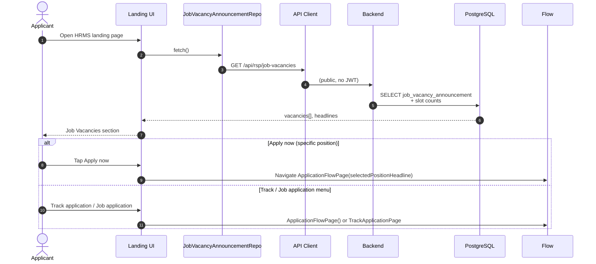
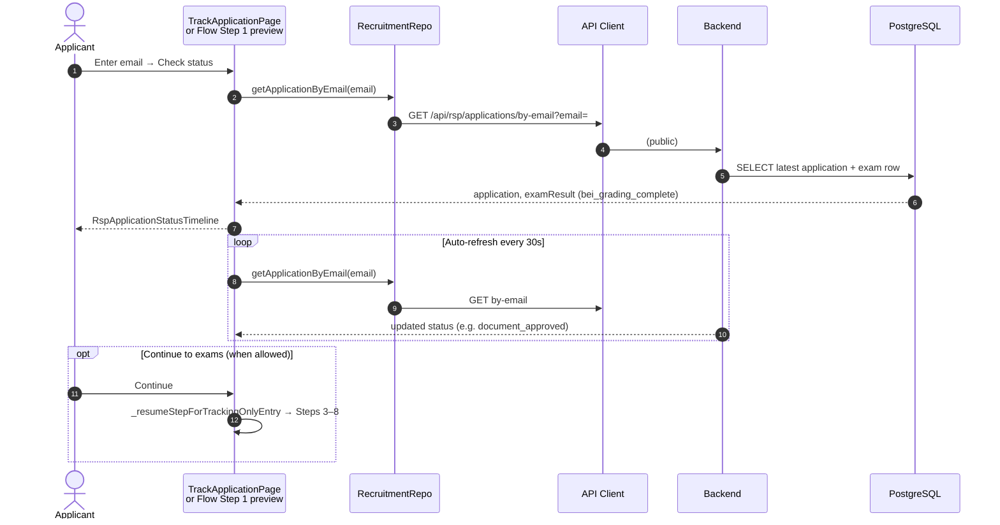
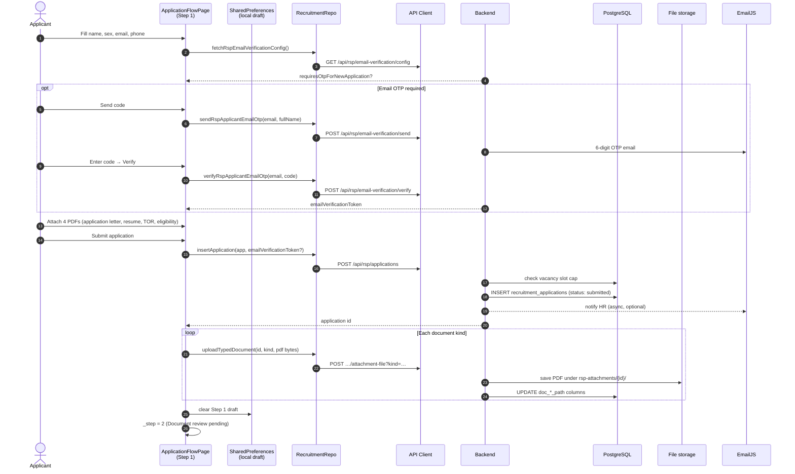
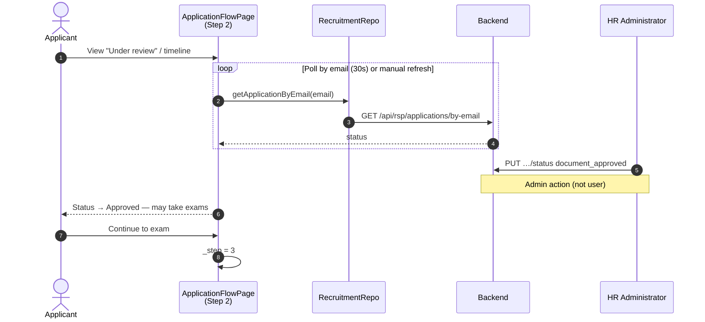
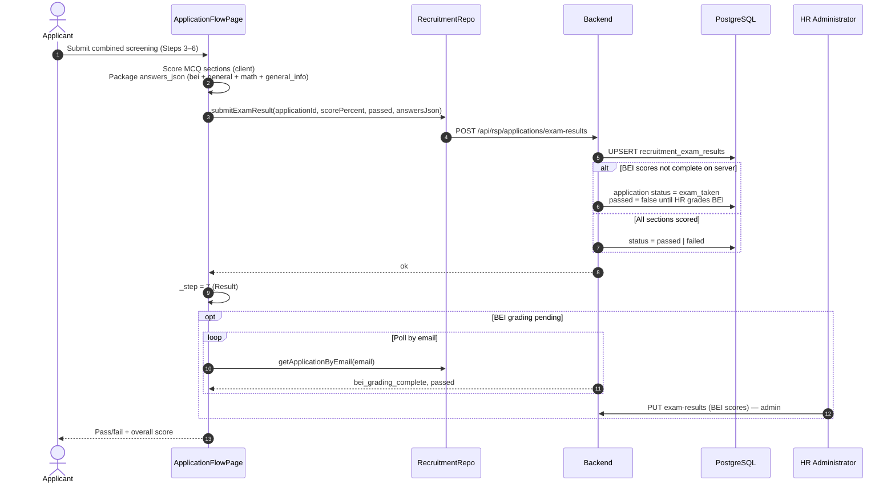
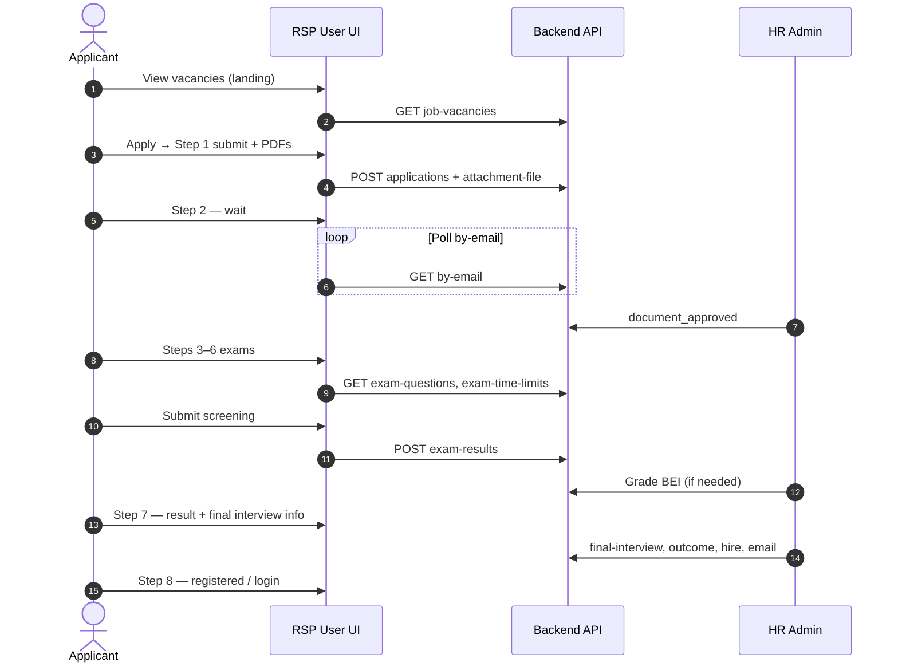

# RSP Module — User (Applicant) Sequence Diagram

Public applicant / user flows in **HRMS Plaridel** for Recruitment, Selection, and Placement (RSP), based on the landing page, `ApplicationFlowPage`, `TrackApplicationPage`, `RecruitmentRepo`, and public backend routes (no admin JWT).

---

## Participants

| Actor / Component | Role |
|-------------------|------|
| **Applicant** | Public user (no login required for recruitment) |
| **Landing UI** | `LandingPage`, `JobVacanciesSection` |
| **Flow UI** | `ApplicationFlowPage`, `TrackApplicationPage` |
| **API Client** | `ApiClient` (unauthenticated for most RSP public endpoints) |
| **Backend** | Express: `rspJobVacancies`, `rspApplications`, `rspExamQuestions`, `rspEmailVerificationPublic`, `rspExamTimeLimits` |
| **PostgreSQL** | `recruitment_applications`, `recruitment_exam_results`, `recruitment_exam_questions`, `job_vacancy_announcement` |
| **File storage** | `uploads/rsp-attachments/{applicationId}/` |
| **Email** | EmailJS (optional Step 1 OTP; HR notification on new application) |
| **HR Admin** | Approves documents, grades BEI, schedules interview, hires (external to user UI) |

---

## Application flow steps (UI)

| Step | Screen | When available |
|------|--------|----------------|
| 1 | Basic info + documents (or track-only status) | Apply now / Continue / Track |
| 2 | Document review pending | After Step 1 submit (`submitted`) |
| 3 | BEI (8 narrative questions) | After HR `document_approved` |
| 4 | General Exam (MCQ) | During exam sequence |
| 5 | Mathematics Exam (MCQ) | During exam sequence |
| 6 | General Information Exam (MCQ) | During exam sequence |
| 7 | Screening result | After `POST exam-results`; polls until BEI graded |
| 8 | Final hiring status | Passed exam + HR updates (interview, registered) |

---

## 1. Browse vacancies (landing page)



---

## 2. Track application by email



---

## 3. Step 1 — Apply (basic info, email OTP, documents)



---

## 4. Step 2 — Wait for document approval



---

## 5. Steps 3–6 — Screening exams (BEI + MCQ)

```mermaid
sequenceDiagram
    autonumber
    actor User as Applicant
    participant UI as ApplicationFlowPage<br/>(Steps 3–6)
    participant Repo as RecruitmentRepo
    participant BE as Backend
    participant DB as PostgreSQL

    User->>UI: Step 3 — BEI
    UI->>Repo: getExamQuestions('bei')
    Repo->>BE: GET /api/rsp/exam-questions/bei
    BE->>DB: SELECT recruitment_exam_questions
    BE-->>UI: 8 questions
    User->>UI: Type narrative answers (stored locally until submit)

    User->>UI: Step 4 — General Exam
    UI->>Repo: getExamTimeLimits() + getExamQuestionsWithOptions('general')
    BE-->>UI: questions + timer (e.g. 45 min)
    User->>UI: Answer MCQs (client timer; auto-advance on expiry)

    User->>UI: Step 5 — Mathematics Exam
    UI->>BE: GET exam-questions/math + time limits
    User->>UI: Answer MCQs

    User->>UI: Step 6 — General Information Exam
    UI->>BE: GET exam-questions/general_info
    User->>UI: Answer MCQs → Submit all exams
```

---

## 6. Submit exam results (Step 7)



---

## 7. Steps 7–8 — Final interview & hiring (read HR updates)

```mermaid
sequenceDiagram
    autonumber
    actor User as Applicant
    participant UI as ApplicationFlowPage<br/>(Steps 7–8)
    participant Repo as RecruitmentRepo
    participant BE as Backend
    participant HR as HR Administrator

    Note over User,HR: User does not schedule interview;<br/>polls public by-email API

    loop Status refresh
        UI->>Repo: getApplicationByEmail(email)
        Repo->>BE: GET /api/rsp/applications/by-email
        BE-->>UI: final_interview_at, final_interview_passed,<br/>hired_user_id, hr_account_setup_done, status
    end

    HR->>BE: PUT final-interview (schedule)
    UI-->>User: Show interview date/time (Step 7)

    HR->>BE: PUT final-interview-outcome (pass/fail)
    UI-->>User: Final interview result

    HR->>BE: POST /api/employees + PUT hired-link
    BE->>BE: status = registered
    UI->>UI: _step = 8

    HR->>BE: POST send-hire-email (credentials)
    UI-->>User: Hiring complete — link to LoginPage

    opt Account setup monitoring
        HR->>BE: PUT hr-account-setup-monitoring
        UI-->>User: Step 8 shows account ready message
    end
```

---

## 8. End-to-end user lifecycle (summary)



---

## Status reference (applicant-visible)

| Status | Applicant experience |
|--------|----------------------|
| `submitted` | Step 2: documents under HR review |
| `document_approved` | May continue to BEI / MCQ exams |
| `document_declined` | Cannot proceed; contact HR |
| `exam_taken` | Exam submitted; waiting for HR BEI grading |
| `passed` / `failed` | Screening result on Step 7 |
| `registered` | Hired; Step 8 / employee account linked |

---

## Key public API endpoints (no admin JWT)

| Action | Method | Path |
|--------|--------|------|
| List vacancies | GET | `/api/rsp/job-vacancies` |
| Email OTP config | GET | `/api/rsp/email-verification/config` |
| Send OTP | POST | `/api/rsp/email-verification/send` |
| Verify OTP | POST | `/api/rsp/email-verification/verify` |
| Create application | POST | `/api/rsp/applications` |
| Track by email | GET | `/api/rsp/applications/by-email?email=` |
| Upload document PDF | POST | `/api/rsp/applications/:id/attachment-file?kind=` |
| Exam questions | GET | `/api/rsp/exam-questions/:type` (`bei`, `general`, `math`, `general_info`) |
| Exam time limits | GET | `/api/rsp/exam-time-limits` |
| Submit screening | POST | `/api/rsp/applications/exam-results` |

Admin-only actions (shown as external messages in diagrams): `PUT …/status`, BEI grading, final interview, hire link, hire email.

---

## Visual diagram

Rendered overview PNG:

`docs/rsp-user-sequence-diagram.png`

(Re-export Mermaid blocks via [mermaid.live](https://mermaid.live) for SVG/PDF.)
