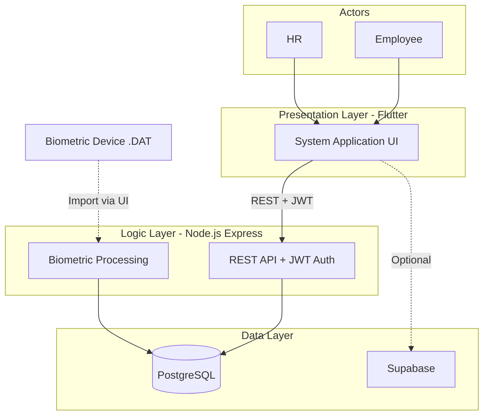

# HRMS Plaridel — System Architecture & Development Overview

> Human Resource Management System for the Municipality of Plaridel, Misamis Occidental.  
> Streamlines recruitment, employee records, **time and attendance (DTR, incl. leave)**, document tracking, and HR forms for both **Admin** and **Employees**, with responsive layouts for **web** and **mobile**.

---

## 1. High-Level Architecture

```
┌─────────────────────────────────────────────────────────────────────────────────────────┐
│                                    ACTORS                                                 │
│  ┌──────────────┐    ┌──────────────┐                                                    │
│  │   Employee   │    │     HR       │                                                    │
│  └──────┬───────┘    └──────┬───────┘                                                    │
│         │                   │                                                            │
│         └───────────────────┼───────────────────────────────────────────────────────────┘
│                             │
│                             ▼
│  ┌─────────────────────────────────────────────────────────────────────────────────────┐
│  │                    PRESENTATION LAYER                                                 │
│  │                  System Application UI                                                │
│  │              (Flutter — Web, Android, iOS, Windows)                                   │
│  │                                                                                       │
│  │  • Admin Dashboard  • Employee Dashboard  • Landing Page  • Login                     │
│  │  • DTR Module (incl. Leave)  • DocuTracker  • Recruitment (RSP)  • L&D               │
│  └─────────────────────────────────────────────┬───────────────────────────────────────┘
│                                                │
│                                                │  REST API (JSON)
│                                                │  JWT Auth
│                                                ▼
│  ┌─────────────────────────────────────────────────────────────────────────────────────┐
│  │                    LOGIC LAYER (Backend)                                              │
│  │              Node.js (Express)                                                        │
│  │                                                                                       │
│  │  Auth (JWT)  RBAC  Biometric Processing  DTR Summary  Late/Undertime Calc             │
│  │  Attendance Policies  DTR Corrections  Equivalent Day  Leave (DTR)                    │
│  └─────────────────────────────────────────────┬───────────────────────────────────────┘
│                                                │
│         ┌──────────────────────────────────────┼──────────────────────────────────────┐
│         │                                      │                                       │
│         ▼                                      ▼                                       ▼
│  ┌──────────────────┐              ┌──────────────────────┐              ┌─────────────────────┐
│  │ Biometric Device │              │   PostgreSQL         │              │ Supabase (optional)  │
│  │ .DAT file export │──────────────│   Primary Database   │              │ DocuTracker, Forms   │
│  │ Import via UI    │              │   HR, DTR, Leave     │              │ Job Vacancies, BI    │
│  └──────────────────┘              └──────────────────────┘              └─────────────────────┘
└─────────────────────────────────────────────────────────────────────────────────────────┘
```

---

### 1.1 Mermaid Diagram (for Markdown viewers)



---

## 2. Technology Stack

| Layer           | Technology              | Purpose                                              |
|----------------|-------------------------|------------------------------------------------------|
| **Frontend**   | Flutter 3.x             | Cross-platform UI (Web, Android, iOS, Windows)       |
| **State**      | Provider                | State management (Auth, DTR, DocuTracker, Leave)     |
| **HTTP**       | Dio                     | API client with JWT interceptor                      |
| **Storage**    | Flutter Secure Storage  | JWT token persistence                                |
| **Backend**    | Node.js + Express       | REST API, business logic                             |
| **Database**   | PostgreSQL              | Primary data store (users, DTR, leave, employees)    |
| **Auth**       | JWT                     | Stateless authentication                             |
| **Optional**   | Supabase                | DocuTracker migrations, some form data               |

---

## 2.1 Programming Languages

| Language    | Where Used                      | Purpose                                           |
|-------------|----------------------------------|---------------------------------------------------|
| **Dart**    | `lib/`, Flutter app              | Frontend (UI, logic, API calls)                   |
| **JavaScript** | `backend/src/`                | Backend API (Node.js + Express)                   |
| **SQL**     | `backend/scripts/`, `supabase/migrations/` | Schema, migrations, seeds             |
| **YAML**    | `pubspec.yaml`, `analysis_options.yaml` | Config, package definition                 |
| **JSON**    | `package.json`, API payloads     | Config, data exchange                             |
| **HTML**    | Web output (Flutter web)         | Rendered by Flutter; Word export (HTML-based)     |
| **CSS**     | Web styling (Flutter web)        | Rendered by Flutter                               |

---

## 3. Component Breakdown

### 3.1 Presentation Layer (Flutter)

| Module         | Path                      | Description                                           |
|----------------|---------------------------|-------------------------------------------------------|
| **Main**       | `lib/main.dart`           | App bootstrap, providers, initial route               |
| **Auth**       | `lib/login/`, `lib/providers/auth_provider.dart` | Login, session restore, role-based dashboards |
| **API**        | `lib/api/client.dart`, `config.dart` | Dio client, base URL, JWT attachment             |
| **Admin**      | `lib/admin/screens/admin_dashboard.dart` | Admin nav, DTR, DocuTracker, RSP, L&D       |
| **Employee**   | `lib/employee/screens/employee_dashboard.dart` | Employee dashboard, limited features        |
| **DTR**        | `lib/dtr/`                | Time logs, biometric import, reports, shifts, holidays, **Leave** (DTR feature) |
| **DTR Export** | `lib/dtr/dtr_export.dart` | PDF, Excel, Word export; equivalent day totals; late/undertime columns           |
| **DTR Print**  | `lib/dtr/screens/dtr_reports.dart` + `printing` | Ready-to-print DTR (uses DtrExport.generatePdf, system print/share) |
| **Leave**      | `lib/leave/`              | Leave requests, balances, approval — serves DTR (absence/day-off tracking)      |
| **DocuTracker**| `lib/docutracker/`        | Document routing, workflow, escalation                |
| **Recruitment**| `lib/recruitment/`        | RSP admin, job vacancies, applications                |
| **Landing**    | `lib/landingpage/`        | Public landing page (web), job vacancies              |

### 3.2 Logic Layer (Node.js Backend)

| Component                | Path                             | Description                                                        |
|--------------------------|-----------------------------------|--------------------------------------------------------------------|
| **Entry**                | `backend/src/index.js`           | Express app, CORS, route mounting                                  |
| **Config**               | `backend/src/config/db.js`       | PostgreSQL connection pool                                         |
| **Auth**                 | `backend/src/middleware/auth.js` | JWT verification, `req.user`                                       |
| **RBAC**                 | `backend/src/middleware/rbac.js` | `requireAdmin`, `requireAdminOrSupervisor`                         |
| **Biometric Processing** | `backend/src/services/biometricProcessing.js` | Punch interpretation, DTR summary insert (time_in, break_out, break_in, time_out) |
| **DTR Summary**          | `backend/src/routes/dtrDailySummary.js` | Fetch records, inject holiday/absent rows, compute late/undertime on read |
| **Late/Undertime Calc**  | `dtrDailySummary.js` (computeLateMinutes, computeUndertimeMinutes) | Shift-based late (AM/PM), undertime from work hours                |
| **Attendance Policies**  | `backend/src/routes/attendancePolicies.js` | deduct_late, deduct_undertime, work_hours_per_day, equivalent-day rules |
| **Equivalent Day**       | `backend/src/utils/equivalentDay.js` | Minutes → equivalent day conversion                                |
| **DTR Corrections**      | `backend/src/routes/dtrCorrections.js` | Employee correction requests, admin approval, update dtr_daily_summary |

#### API Routes (mounted under `/api/`)

| Route                     | Purpose                                            |
|---------------------------|----------------------------------------------------|
| `/auth`                   | Login, register, me                                |
| `/api/departments`        | CRUD departments                                   |
| `/api/positions`          | CRUD positions                                     |
| `/api/shifts`             | CRUD shifts                                        |
| `/api/assignments`        | Employee assignments (dept, position, shift)       |
| `/api/employees`          | Employee CRUD, biometric ID lookup                 |
| `/api/upload`             | File upload (avatar, etc.)                         |
| `/api/files`              | File serving (avatar by user ID)                   |
| `/api/holidays`           | Holiday management                                 |
| `/api/attendance-policies`| Attendance policy rules                            |
| `/api/dtr-corrections`    | DTR corrections                                    |
| `/api/biometric-devices`  | Biometric device registry                          |
| `/api/biometric-attendance-logs` | Import raw logs, process to summary        |
| `/api/overtime`           | Overtime records                                   |
| `/api/calendar`           | Calendar data                                      |
| `/api/dtr-daily-summary`  | Daily DTR summary, late/undertime computation, holiday/absent injection |
| `/api/docutracker`        | Document routing, workflow                         |
| `/api/leave`              | Leave requests, balances, approval                 |

#### DTR Logic: Backend vs Frontend

| Logic                        | Layer   | Location                                                                 |
|-----------------------------|---------|---------------------------------------------------------------------------|
| Late/undertime calculation  | Backend | `dtrDailySummary.js` (computeLateMinutes, computeUndertimeMinutes)       |
| Equivalent day conversion   | Backend | `equivalentDay.js`; policies in `attendancePolicies.js`                  |
| Export (PDF, Excel, Word)   | Frontend| `dtr_export.dart` — formats data, fetches policy from API, computes totals for display |
| Print (ready to print)      | Frontend| `dtr_reports.dart` + `printing` package — uses DtrExport.generatePdf     |

### 3.3 Data Layer

#### PostgreSQL (primary)

- **users** — Employees, auth (email, password_hash, role, biometric_user_id)
- **departments**, **positions**, **shifts**
- **assignments**, **policy_assignments**
- **holidays**
- **leave_types**, **leave_requests**, **leave_balances**
- **biometric_devices**, **biometric_attendance_logs**
- **dtr_daily_summary** — Computed daily records (time_in, time_out, total_hours, etc.)
- DocuTracker tables (routing, workflow steps, etc.)

#### Supabase (optional)

- DocuTracker migrations (`supabase/migrations/`)
- Job vacancies, BI forms, recruitment-related data (where configured)

---

## 4. Data Flow

### 4.1 User Path

1. **Employee/HR** → Login (`POST /auth/login`)
2. JWT stored in Flutter Secure Storage
3. Requests include `Authorization: Bearer <token>`
4. UI → API → PostgreSQL for CRUD

### 4.2 Biometric Path

1. **Biometric device** exports `.DAT` attendance file
2. **HR/Admin** uploads file via DTR Import UI
3. Flutter parses `.DAT` (via `biometric_dat_parser.dart`)
4. Backend receives matched rows → `POST /api/biometric-attendance-logs/import`
5. Rows inserted into `biometric_attendance_logs`
6. `processBiometricLogsToSummary()` interprets punches (time_in, break_out, break_in, time_out)
7. Results written to `dtr_daily_summary`

### 4.3 Leave Path (DTR feature)

1. Employee submits leave request via DTR/Leave
2. `POST /api/leave` → `leave_requests` table
3. Admin/HR approves via `PATCH /api/leave/:id`
4. Balances updated in `leave_balances`

---

## 5. Roles & Access Control

| Role        | Typical Access                                                |
|-------------|----------------------------------------------------------------|
| **admin**   | Full access: DTR, Leave, DocuTracker, RSP, employees, settings |
| **hr**      | HR functions, approvals, leave/DTR management                  |
| **supervisor** | Approvals, team view                                        |
| **employee**   | Own DTR, leave requests, DocuTracker documents              |

Enforced via `requireAdmin`, `requireAdminOrSupervisor`, `requireRole` in backend routes.

---

## 6. Project Structure (Key Paths)

```
hrms_plaridel/
├── lib/                          # Flutter app
│   ├── main.dart
│   ├── api/                      # API client, config, token storage
│   ├── providers/                # Auth, DTR, DocuTracker, Leave
│   ├── admin/                    # Admin dashboard
│   ├── employee/                 # Employee dashboard
│   ├── dtr/                      # DTR module (screens, manage, repos)
│   ├── leave/                    # Leave (DTR feature: absence/day-off tracking)
│   ├── docutracker/              # DocuTracker module
│   ├── recruitment/              # RSP, job vacancies
│   ├── landingpage/              # Public landing
│   └── ...
├── backend/
│   ├── src/
│   │   ├── index.js
│   │   ├── config/db.js
│   │   ├── middleware/           # auth, rbac
│   │   ├── routes/               # API routes
│   │   └── services/             # biometricProcessing
│   └── scripts/
│       ├── init-schema.sql       # Core schema
│       └── *.sql                 # Migrations, seeds
├── supabase/
│   └── migrations/               # DocuTracker migrations
└── docs/
    └── SYSTEM_ARCHITECTURE_AND_DEVELOPMENT_OVERVIEW.md
```

---

## 7. Development Workflow

### 7.1 Local Setup

1. **Database**: PostgreSQL with `init-schema.sql` and migrations
2. **Backend**: `cd backend && npm install && node src/index.js` (requires `DATABASE_URL`, `JWT_SECRET` in `.env`)
3. **Frontend**: `flutter pub get && flutter run`

### 7.2 API Base URL

- Default: `http://localhost:3000`
- Override: `flutter run --dart-define=API_BASE_URL=http://192.168.1.100:3000` (e.g., LAN deployment)

### 7.3 Health Checks

- `GET /health` — App health
- `GET /health/db` — PostgreSQL connection status

---

## 8. Deployment Considerations

| Aspect       | Notes                                                         |
|-------------|----------------------------------------------------------------|
| **Frontend**| Build: `flutter build web` / `flutter build apk` / `flutter build ios` |
| **Backend** | Node.js on VM or container; use `HOST=0.0.0.0` for LAN access  |
| **Database**| PostgreSQL 12+; run migrations in order                        |
| **Env**     | `DATABASE_URL`, `JWT_SECRET`, `PORT`, `HRMS_TIMEZONE` (e.g. Asia/Manila) |
| **CORS**    | Backend uses `cors()`; restrict origins in production          |

---

## 9. Enhancements to Your Current Diagram

Your current diagram captures the core flow: **User → UI → Logic → Database** and **Biometric Device → Logic → Database**. This document extends it by:

1. **Explicit tech stack** — Flutter, Node.js, PostgreSQL, optional Supabase  
2. **Role-based access** — Admin, HR, supervisor, employee  
3. **Module breakdown** — DTR (incl. Leave), DocuTracker, Recruitment, L&D  
4. **API structure** — REST routes and auth flow  
5. **Biometric detail** — .DAT import → raw logs → daily summary  
6. **DTR logic** — Late/undertime (backend), export/print (frontend), equivalent day (both)  
7. **Development and deployment** — Local setup, env vars, build commands  

You can use this as a living document and update it as new modules (e.g., payroll, learning & development) are added.
